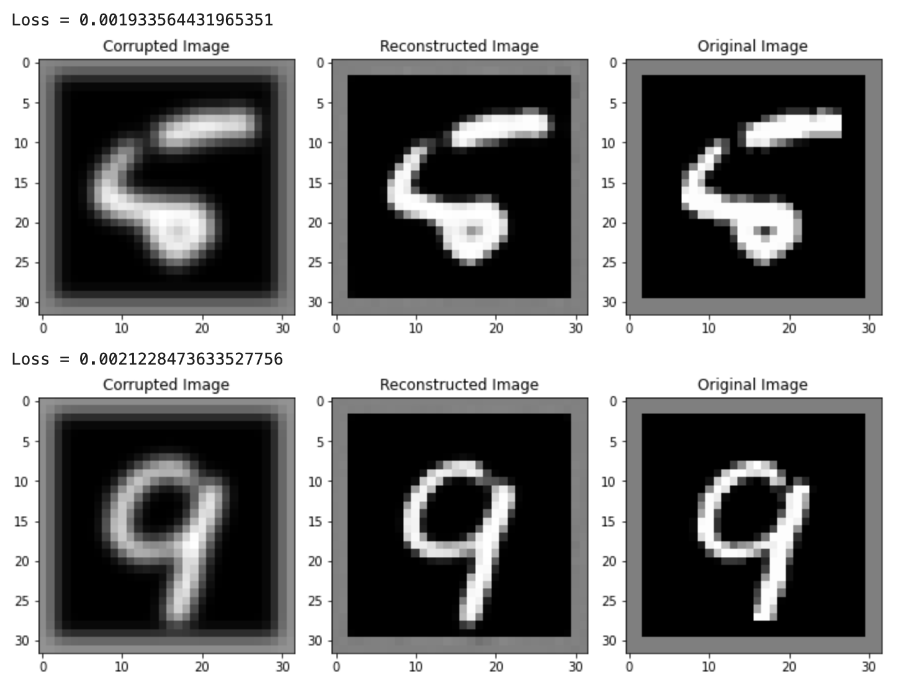

# MNISTDenoisingAutoencoder
Implementation of a simple CNN architecture for use in a denoising autoencoder for MNIST images corrupted with a Gaussian blur from the PyPI [image corruptions](https://pypi.org/project/imagecorruptions/#description) library. The MNIST training images were further split into 4:1 training and validation sets. After training and validation, the model was evaluated on the testing set. All training and testing was done in a Jupyter notebook with PyTorch.

## Hyperparameters
- Batch size = 8
- Learning rate = 0.001
  - Implemented StepLR learning rate scheduler with step size = 5, gamma = 0.1
- Optimizer = Adam with weight decay = 1e-5
- Criterion = Mean squared error loss
- Epochs = 10

## Results
Over 10 epochs of training, both the average training loss and validation loss over the epoch converged to a minima of 0.00200. This trained model was then evalauted on the test set of MNIST images for a total average testing loss of 0.00198. This training and more examples of reconstructed images can be seen in the Results.html file.

### Sample of Results

